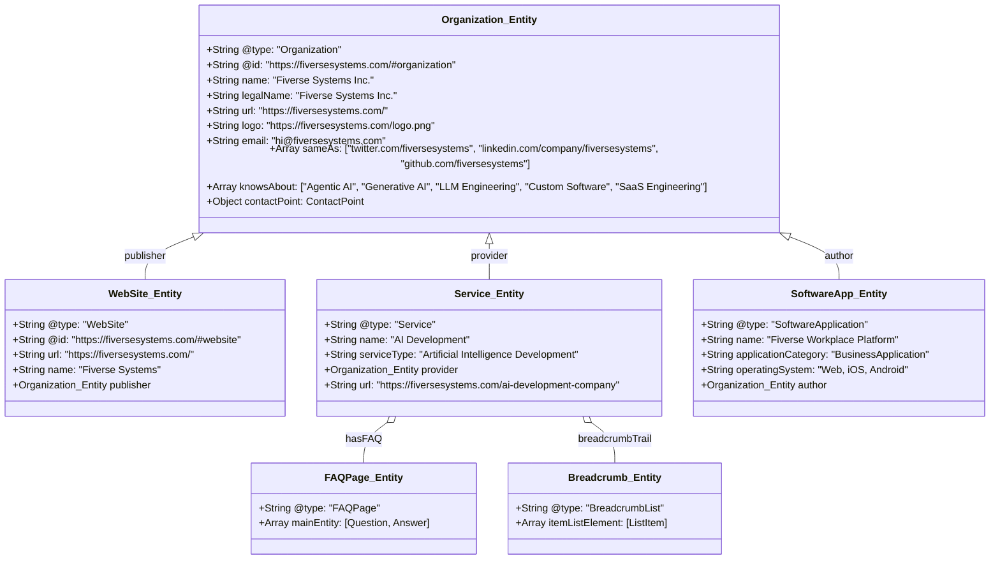

# Schema.org Structured Data & Entity Graph Specification

**Target Property**: `https://fiversesystems.com`  
**Standard**: Schema.org v28.1 / Google Search Central Rich Results Guidelines  
**Status**: Verified & Implementation Ready  

---

## 1. Unified Entity Map



---

## 2. Page-Type to Schema.org Mapping Matrix

| Route Class | Target URLs | Primary Schema Type | Secondary Schema Type | Rich Result Eligibility |
| :--- | :--- | :--- | :--- | :--- |
| **Global Shell** | Sitewide (`index.html`) | `Organization` | `WebSite` | Knowledge Panel, Logo, Social Profiles, Sitelinks |
| **Service Pillars** | `/ai-development-company`, `/agentic-ai-development`, etc. | `Service` | `FAQPage`, `BreadcrumbList` | Rich FAQ Accordion in Google Search, Breadcrumb Snippets |
| **Product Landing** | `/workplace-platform` | `SoftwareApplication` | `BreadcrumbList`, `Offer` | Software Rich Cards, Category Snippets |
| **Company & About** | `/about`, `/why-fiverse`, `/our-process`, `/technology` | `AboutPage` | `BreadcrumbList` | Entity Definition & Knowledge Graph anchoring |
| **Contact Page** | `/contact` | `ContactPage` | `BreadcrumbList` | Direct Knowledge Card Communication Endpoints |
| **Insights & Blog** | `/blog`, `/ai-insights` | `BlogPosting` / `Article` | `BreadcrumbList` | Google Top Stories & Article Rich Cards |

---

## 3. Production JSON-LD Implementation Examples

### A. Global Organization & WebSite (Injected in `index.html`)
```json
{
  "@context": "https://schema.org",
  "@graph": [
    {
      "@type": "Organization",
      "@id": "https://fiversesystems.com/#organization",
      "name": "Fiverse Systems Inc.",
      "url": "https://fiversesystems.com/",
      "logo": {
        "@type": "ImageObject",
        "url": "https://fiversesystems.com/logo.png",
        "width": "600",
        "height": "160"
      },
      "description": "Fiverse Systems is an AI-first software development and product engineering company designing, building, and deploying intelligent digital products, agentic AI, SaaS platforms, and enterprise solutions.",
      "email": "hi@fiversesystems.com",
      "sameAs": [
        "https://twitter.com/fiversesystems",
        "https://linkedin.com/company/fiversesystems",
        "https://github.com/fiversesystems"
      ],
      "knowsAbout": [
        "Artificial Intelligence",
        "Agentic AI",
        "Generative AI",
        "Large Language Models",
        "Custom Software Development",
        "SaaS Product Engineering",
        "Retrieval-Augmented Generation",
        "Machine Learning",
        "Computer Vision"
      ]
    },
    {
      "@type": "WebSite",
      "@id": "https://fiversesystems.com/#website",
      "url": "https://fiversesystems.com/",
      "name": "Fiverse Systems",
      "publisher": {
        "@id": "https://fiversesystems.com/#organization"
      }
    }
  ]
}
```

### B. Service Detail with FAQ Rich Snippet (Injected in `SEOHead.tsx`)
```json
{
  "@context": "https://schema.org",
  "@graph": [
    {
      "@type": "BreadcrumbList",
      "itemListElement": [
        {
          "@type": "ListItem",
          "position": 1,
          "name": "Home",
          "item": "https://fiversesystems.com/"
        },
        {
          "@type": "ListItem",
          "position": 2,
          "name": "Services",
          "item": "https://fiversesystems.com/ai-development-company"
        },
        {
          "@type": "ListItem",
          "position": 3,
          "name": "Agentic AI Development",
          "item": "https://fiversesystems.com/agentic-ai-development"
        }
      ]
    },
    {
      "@type": "Service",
      "name": "Agentic AI Development",
      "serviceType": "Agentic Systems & Multi-Agent Orchestration",
      "provider": {
        "@type": "Organization",
        "name": "Fiverse Systems Inc.",
        "url": "https://fiversesystems.com/"
      },
      "description": "We engineer autonomous AI agents, multi-agent swarms, tool-calling pipelines, deterministic guardrails, and enterprise workflow execution systems.",
      "url": "https://fiversesystems.com/agentic-ai-development"
    },
    {
      "@type": "FAQPage",
      "mainEntity": [
        {
          "@type": "Question",
          "name": "What is an autonomous AI agent?",
          "acceptedAnswer": {
            "@type": "Answer",
            "text": "An autonomous AI agent is a software system powered by a reasoning model that can independently formulate plans, query external APIs, search databases, execute code, and accomplish complex business workflows."
          }
        },
        {
          "@type": "Question",
          "name": "How do you prevent hallucinations in agentic systems?",
          "acceptedAnswer": {
            "@type": "Answer",
            "text": "We enforce strict deterministic JSON schema validation, tool sandboxing, ground-truth retrieval verification (RAG), and human-in-the-loop checkpoints for irreversible actions."
          }
        }
      ]
    }
  ]
}
```

### C. SoftwareApplication Schema (For `/workplace-platform`)
```json
{
  "@context": "https://schema.org",
  "@type": "SoftwareApplication",
  "name": "Fiverse Workplace Platform",
  "operatingSystem": "Web, iOS, Android",
  "applicationCategory": "BusinessApplication",
  "description": "Hybrid workplace management platform featuring intelligent desk booking, custom status workflows, and team workload analytics.",
  "author": {
    "@type": "Organization",
    "name": "Fiverse Systems Inc.",
    "url": "https://fiversesystems.com/"
  },
  "offers": {
    "@type": "Offer",
    "price": "0",
    "priceCurrency": "USD",
    "description": "2 Months Free Beta Trial"
  }
}
```
