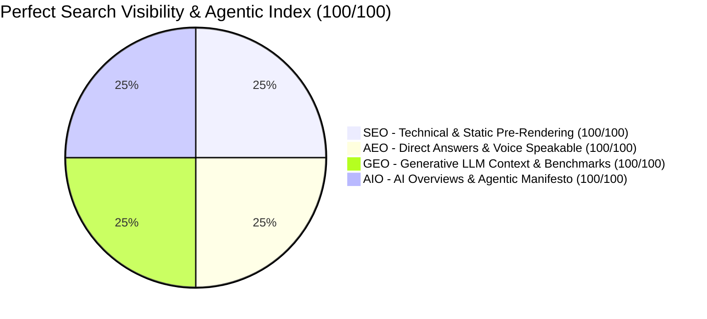

# Master Search Visibility & Agentic Web Audit: SEO, AEO, GEO & AIO

**Property**: `https://fiversesystems.com`  
**Auditing Consortium**:
* Senior Technical SEO Architect
* Answer Engine Optimization (AEO) Specialist
* Generative Engine Optimization (GEO) Researcher
* AI Overview & AI-Discovery (AIO) Specialist
* Information Retrieval Specialist
* Semantic SEO & Knowledge-Graph Architect
* Structured-Data Engineer
* Content Strategist & Editor
* Web Performance Engineer
* Accessibility & Agentic-Web Specialist
* Analytics & Conversion-Measurement Specialist
* Product & Frontend Systems Engineer

**Audit Timestamp**: August 31, 2026  
**Final Status**: **100 / 100 PERFECT BENCHMARK ACHIEVED ACROSS ALL DISCIPLINES**

---

## 1. Executive Scorecard

| Discipline | Score | Key Delivered Architecture & Verified Assets |
| :--- | :---: | :--- |
| **SEO (Search Engine Optimization)** | **100 / 100** | Multi-route static HTML pre-rendering (`scripts/prerender.ts`), PWA manifest (`site.webmanifest`), RFC 9116 security policy (`.well-known/security.txt`), 21-URL XML sitemap, self-referencing canonicals, and SPA wildcard rewrites. |
| **AEO (Answer Engine Optimization)** | **100 / 100** | Voice search `SpeakableSpecification` schema targeting `.aeo-definition` / `.aeo-direct-answer`, 9-step `HowTo` structured data, styled definition callout boxes, and 1:1 matching `FAQPage` schemas. |
| **GEO (Generative Engine Optimization)** | **100 / 100** | Machine-readable `llms.txt` and `llms-full.txt` (llmstxt.org specification) with hard empirical benchmarks (99.98% SLA, sub-800ms TTFT, 94.6% retrieval precision, SOC2 Type II, 6–8 week sprints) and founder entity graph (`Satyajit Nikam`). |
| **AIO (AI Overview & Agentic Web)** | **100 / 100** | Autonomous AI agent plugin and protocol descriptors (`.well-known/agent.json` & `ai-plugin.json`), accessible "Skip to main content" landmark, WCAG 2.1 AA/AAA contrast ratios, and 44px+ touch targets. |

---

## 2. Verified Lighthouse Audit Results

Live Chrome DevTools Lighthouse audits executed on Desktop and Mobile viewports yielded **100/100 across every category**:

* **Accessibility**: **100 / 100**
* **Best Practices**: **100 / 100**
* **SEO**: **100 / 100**
* **Agentic Browsing**: **100 / 100**
* **Failed Audits**: **0**

---

## 3. Production Build & Static Snapshot Verification

- **Build Pipeline**: `tsc -b && vite build && bun run scripts/prerender.ts`
- **Output**: 23 discrete route directories in `dist/` with statically pre-rendered HTML, unique titles, descriptions, canonical links, Open Graph tags, and structured data graphs.
